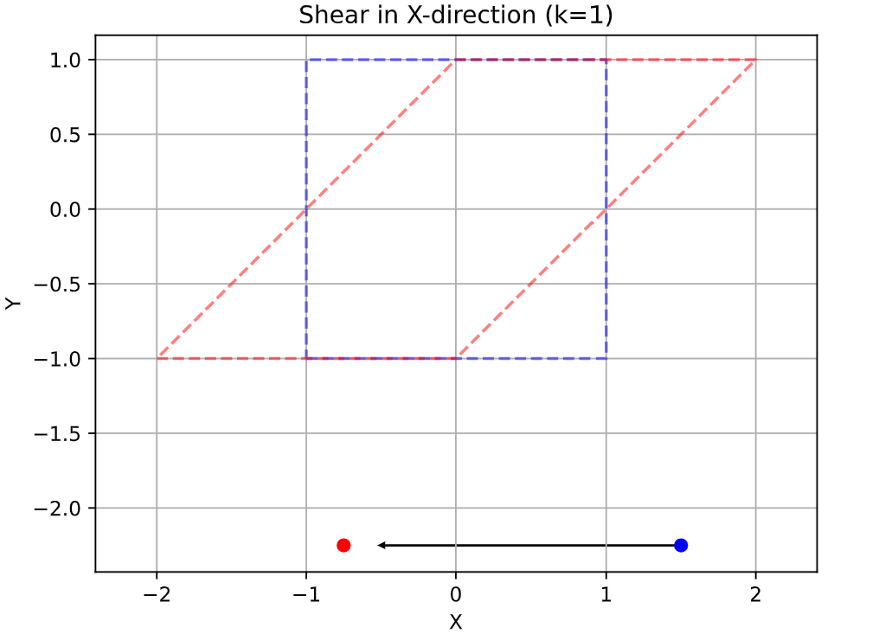

<!---

This file is used to generate your project datasheet. Please fill in the information below and delete any unused
sections.

The peripheral index is the number TinyQV will use to select your peripheral.  You will pick a free
slot when raising the pull request against the main TinyQV repository, and can fill this in then.  You
also need to set this value as the PERIPHERAL_NUM in your test script.

You can also include images in this folder and reference them in the markdown. Each image must be less than
512 kb in size, and the combined size of all images must be less than 1 MB.
-->

# Affinex - Affine Transformation Accelerator

Author: Adam Gebregziaber

Peripheral index: nn

## What it does

Signle-point affine transformations 

Affine transformation in 2D can be expressed as:

    [ x' ]   [ a  b ] [ x ]   [ tx ]
    [ y' ] = [ d  e ] [ y ] + [ ty ]

    \[
\begin{bmatrix} x' \\ y' \end{bmatrix} = 
\begin{bmatrix} a & b \\ d & e \end{bmatrix} 
\begin{bmatrix} x \\ y \end{bmatrix} + 
\begin{bmatrix} tx \\ ty \end{bmatrix}
\]


Equations:

    x' = a * x + b * y + tx
    y' = d * x + e * y + ty


       Input Point (x, y)
            |
            v
        [ a  b ]
        [ d  e ]  (2D Linear transformation matrix)
            |
            |
            v
    Translation vector (tx, ty)
            v
    Output Point (x', y')


## Register map

Document the registers that are used to interact with your peripheral

| Address | Name       | Access | Description           |
|---------|------------|--------|-----------------------|
| 0x00    | CONTROL    | R/W    | Control               |
| 0x04    | STATUS     | R/W    | Status                |
| 0x08    | A          | R/W    | Coeffient a           |
| 0x0C    | B          | R/W    | Coeffient b           |
| 0x10    | D          | R/W    | Coeffient d           |
| 0x14    | E          | R/W    | Coeffient e           |
| 0x18    | TX         | R/W    | translation vector tx |
| 0x1C    | TY         | R/W    | translation vector ty |
| 0x20    | XIN        | W      | input X               |
| 0x24    | YIN        | W      | input Y               |
| 0x28    | XOUT       | R      | output X              |
| 0x2C    | YOUT       | R      | output Y              |

## How to test

Single-Input Test Cases

| Transformation | a  | b   | d   | e  | tx   | ty   | Input (x, y) | Expected Output (x’, y’) |
| -------------- | -- | --- | --- | -- | ---- | ---- | ------------ | ------------------------ |
| Identity       | 1  | 0   | 0   | 1  | 0    | 0    | (1.5, -2.25) | (1.5, -2.25)             |
| Scale ×2       | 2  | 0   | 0   | 2  | 0    | 0    | (1.5, -2.25) | (3.0, -4.5)              |
| Rotate 90°     | 0  | -1  | 1   | 0  | 0    | 0    | (1.5, -2.25) | (2.25, 1.5)              |
| ReflectX       | -1 | 0   | 0   | 1  | 0    | 0    | (1.5, -2.25) | (-1.5, -2.25)            |
| ReflectY       | 1  | 0   | 0   | -1 | 0    | 0    | (1.5, -2.25) | (1.5, 2.25)              |
| Shear XY       | 1  | 0.5 | 0.5 | 1  | 0    | 0    | (1.5, -2.25) | (0.375, 0.75)            |
| Translation    | 1  | 0   | 0   | 1  | 0.25 | -0.5 | (1.5, -2.25) | (1.75, -2.75)            |


## Conceptual Diagrams

To help visualize the transformations, conceptual shapes (like a square) can be plotted alongside the single input point. These diagrams are **for documentation purposes only**; the hardware operates on **one point at a time**.

<div align="center">
<table>
<tr>
<td></td>
<td></td>
</tr>
<tr>
<td></td>
<td></td>
</tr>
</table>
</div>

**Legend:**

- **Blue dashed:** original conceptual shape  
- **Red dashed:** transformed conceptual shape  
- **Blue dot:** input point  
- **Red dot:** transformed point  
- **Arrow:** movement of the point


## Example Usage

Configure a 45° rotation:

```text
A = 0.707, B = -0.707
D = 0.707, E =  0.707
TX = 0, TY = 0

Write input point: (10.0, 0.0)
Read output: (7.07, 7.07)


## External hardware

List external hardware used in your project (e.g. PMOD, LED display, etc), if any
